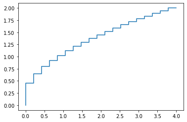
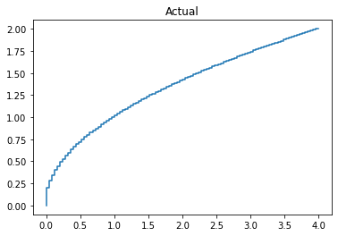
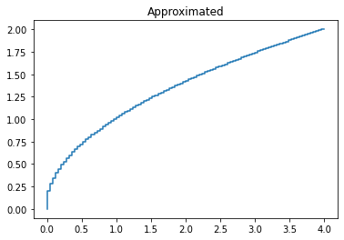

<h2> <font color='green'>Approximation for Square Root </font> </h2>
<h3> - EE 456, Aishwarye Omer, ado5146@psu.edu </h3>

#### $Idea$: Each cell in the middle layer will be active only if the input time(x) is greater than the bias. We calculate $\sqrt{0.1}$ for the first cell and make it the weight.  
#### If $0.2 > x \geq 0.3$, then first two cells will be active. Therefore weight for second cell will be $\sqrt{0.2} - \sqrt{0.1}$
#### Similarly for each next cell weight would be $\sqrt{n} - \sqrt{n-0.1}$


```python
import numpy as np
from matplotlib import pyplot as plt

#Calculate root values for few inputs between 0-4
lst = np.linspace(0.0,4,20) 
print("time",lst)
y=[]
for i in lst:
    y.append(i**0.5)

print("root",y)
plt.step(lst,y)
plt.show()
```

    time [0.         0.21052632 0.42105263 0.63157895 0.84210526 1.05263158
     1.26315789 1.47368421 1.68421053 1.89473684 2.10526316 2.31578947
     2.52631579 2.73684211 2.94736842 3.15789474 3.36842105 3.57894737
     3.78947368 4.        ]
    root [0.0, 0.45883146774112354, 0.6488856845230502, 0.7947194142390263, 0.9176629354822471, 1.025978352085154, 1.1239029738980326, 1.2139539573337679, 1.2977713690461004, 1.3764944032233706, 1.4509525002200232, 1.5217718205053643, 1.5894388284780525, 1.654340383737022, 1.7167901505579042, 1.7770466332772772, 1.8353258709644942, 1.8918106058538344, 1.9466570535691503, 2.0]





## Implementation 
### Calculate root(n) - root(n-0.1) for each consecutive cells 


```python
wts = []
wts.append(y[0])
print("Square root \n", y)

indx = 0
for i in y[1:]:
    wts.append(i-y[indx])
    indx+=1

print("\nWts \n",wts)
```

    Square root 
     [0.0, 0.45883146774112354, 0.6488856845230502, 0.7947194142390263, 0.9176629354822471, 1.025978352085154, 1.1239029738980326, 1.2139539573337679, 1.2977713690461004, 1.3764944032233706, 1.4509525002200232, 1.5217718205053643, 1.5894388284780525, 1.654340383737022, 1.7167901505579042, 1.7770466332772772, 1.8353258709644942, 1.8918106058538344, 1.9466570535691503, 2.0]
    
    Wts 
     [0.0, 0.45883146774112354, 0.19005421678192663, 0.14583372971597608, 0.12294352124322083, 0.10831541660290689, 0.09792462181287864, 0.09005098343573525, 0.08381741171233248, 0.07872303417727022, 0.07445809699665262, 0.0708193202853411, 0.06766700797268821, 0.06490155525896957, 0.0624497668208821, 0.060256482719373006, 0.05827923768721699, 0.05648473488934025, 0.05484644771531588, 0.05334294643084969]


### Calculate output for the above network


```python
res = []
inx=1
for i in wts:
    #For each input x, sum of all the active cells less than it will be the output
    res.append(sum(wts[:inx]))
    inx+=1
print(res)
plt.step(lst,res)
plt.show()
```

    [0.0, 0.45883146774112354, 0.6488856845230502, 0.7947194142390263, 0.9176629354822471, 1.025978352085154, 1.1239029738980326, 1.2139539573337679, 1.2977713690461004, 1.3764944032233706, 1.4509525002200232, 1.5217718205053643, 1.5894388284780525, 1.654340383737022, 1.7167901505579042, 1.7770466332772772, 1.8353258709644942, 1.8918106058538344, 1.9466570535691503, 2.0]


```python
#Calculate root values for few inputs between 0-4
#Assumption we have few input and target values for training weights
lst = np.linspace(0.0,4,101) 
# print("time",lst)
y=[]
for i in lst:
    y.append(i**0.5)


plt.step(lst,y)
plt.title("Actual")
plt.show()
wts = []
wts.append(y[0])


indx = 0
for i in y[1:]:
    wts.append(i-y[indx])
    indx+=1


res = []
indx=1
for i in wts:
    #For each input x, sum of all the active cells less than it will be the output
    res.append(sum(wts[:indx]))
    indx+=1

plt.step(lst,res)
plt.title("Approximated")
plt.show()
```







